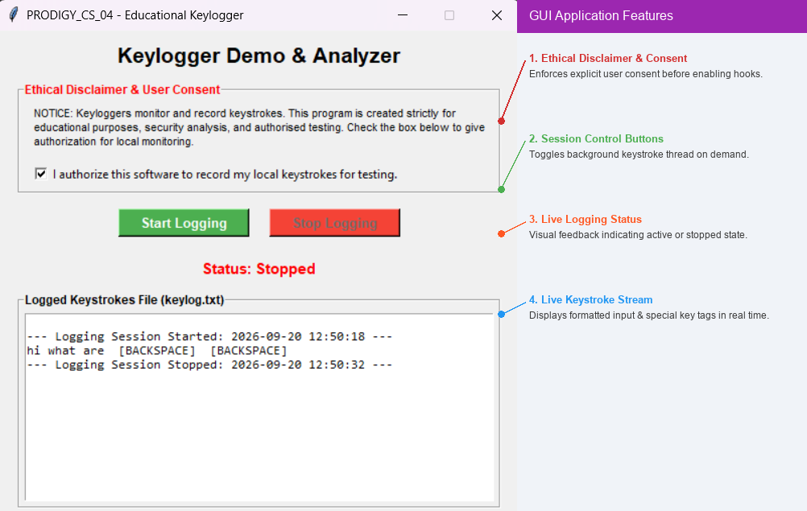

# Simple Keylogger

## Task 04 - Prodigy InfoTech Cyber Security Internship

A Python-based educational keylogging demonstration developed as part of the Prodigy InfoTech Cyber Security Internship.

The project demonstrates how keyboard events can be captured, formatted, displayed, and stored in a local text file for authorized security testing and educational purposes.

## Features

- Simple graphical user interface using Tkinter
- Start and Stop Logging controls
- Explicit user consent before logging
- Displays logging status
- Records keystrokes in a readable format
- Handles special keys such as:
  - Space
  - Enter
  - Backspace
  - Tab
  - Function and control keys
- Adds timestamps to logging sessions
- Saves logged keystrokes to a local text file
- Live log display inside the application

## Technologies Used

- Python
- Tkinter
- pynput
- datetime
- threading

## How It Works

The application provides a graphical interface for controlling the keylogging demonstration.

### 1. User Consent

The user must explicitly authorize keyboard monitoring by selecting the consent checkbox.

### 2. Start Logging

After consent is provided, the user can click **Start Logging**.

A timestamped session is created and keyboard events are recorded.

### 3. Keystroke Formatting

Regular characters are recorded normally.

Special keys are represented using readable labels such as:

```text
[ENTER]
[BACKSPACE]
[TAB]
[SPACE]
```

### 4. Stop Logging

Clicking **Stop Logging** stops the keyboard listener and records the session end time.

### 5. Local Log File

The recorded information is stored locally in:

```text
keylog.txt
```

## Example Log

```text
--- Logging Session Started: 2026-09-20 13:00:00 ---

Hello World
[ENTER]

Testing Keylogger
[ENTER]

--- Logging Session Stopped: 2026-09-20 13:01:00 ---
```

## Installation

Install the required Python library using:

```bash
pip install pynput
```

Tkinter is included with most standard Python installations.

## How to Run

Open a terminal in the project folder and run:

```bash
python main.py
```

## Project Structure

```text
PRODIGY_CS_04/
│
├── main.py
├── README.md
├── .gitignore
└── screenshot.png
```

## Screenshot

### Keylogger GUI



## Ethical Considerations

Keylogging technology can be used for legitimate security research, authorized testing, and educational purposes, but unauthorized monitoring of another person's keystrokes can violate privacy and security.

This project is intended only for:

- Educational purposes
- Authorized security testing
- Personal laboratory environments
- Demonstrating keyboard-event monitoring concepts

Do not use keylogging software to collect passwords, private messages, financial information, or other sensitive information without explicit authorization.

## Task

This project was completed as part of the Prodigy InfoTech Cyber Security Internship.

**Task:** Create a basic keylogger program that records and logs keystrokes, with emphasis on ethical considerations and permissions.

## Disclaimer

This project was developed for educational and authorized security-testing purposes only.

Always obtain explicit permission before monitoring keyboard activity on a device or system.
